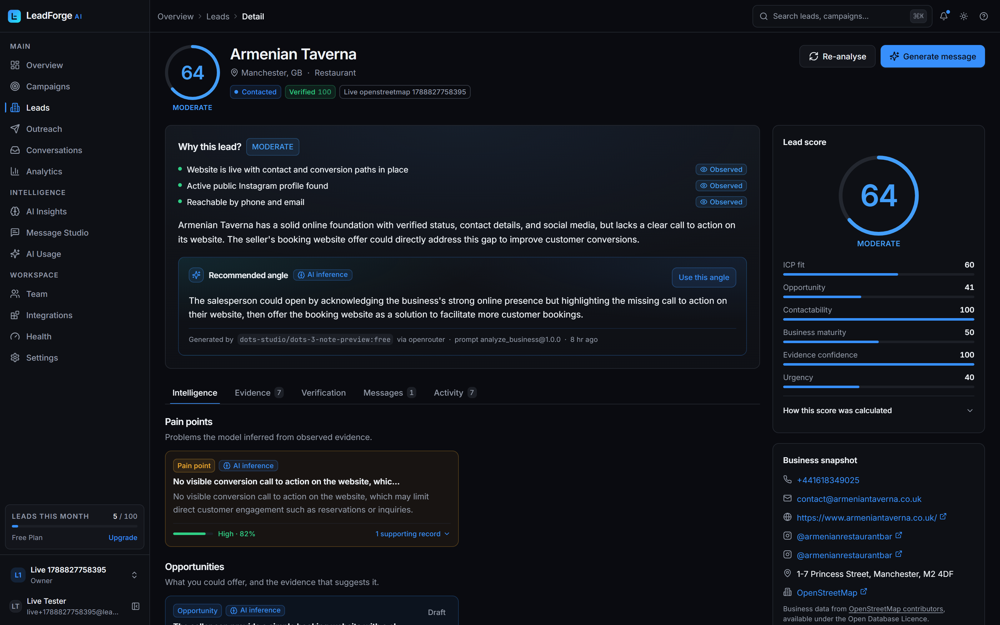
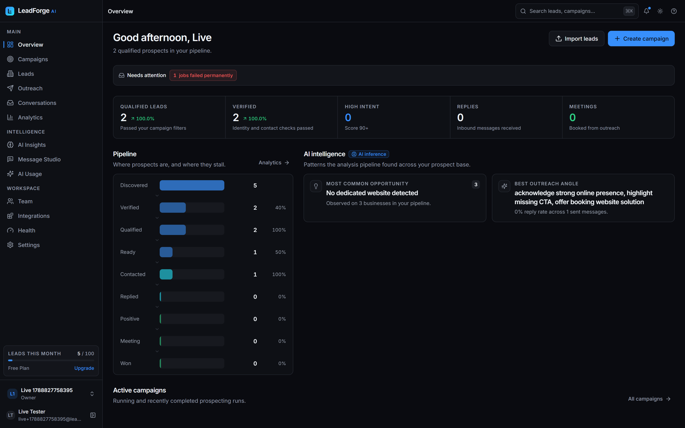
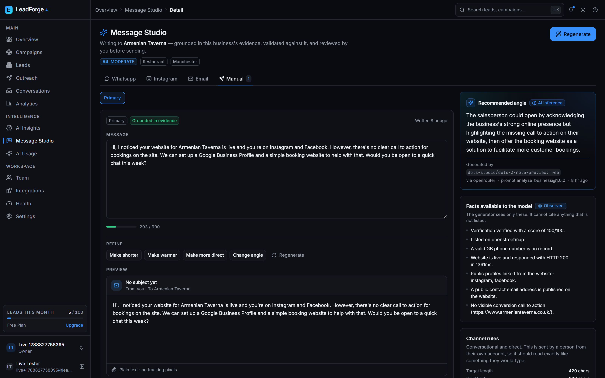
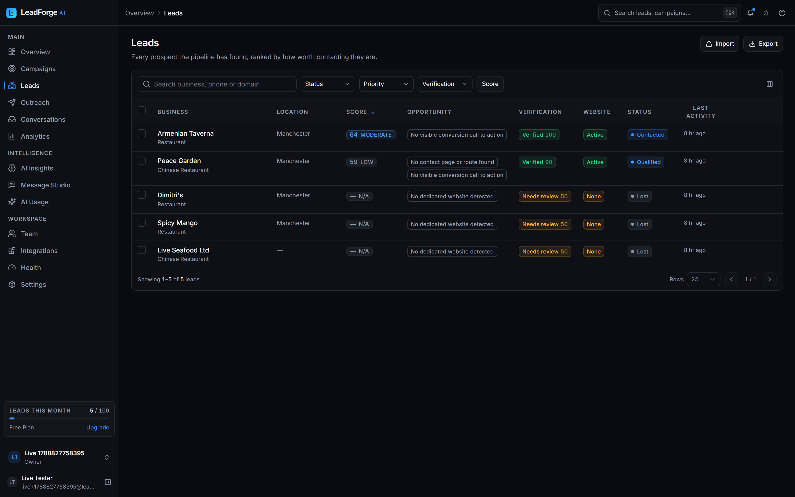
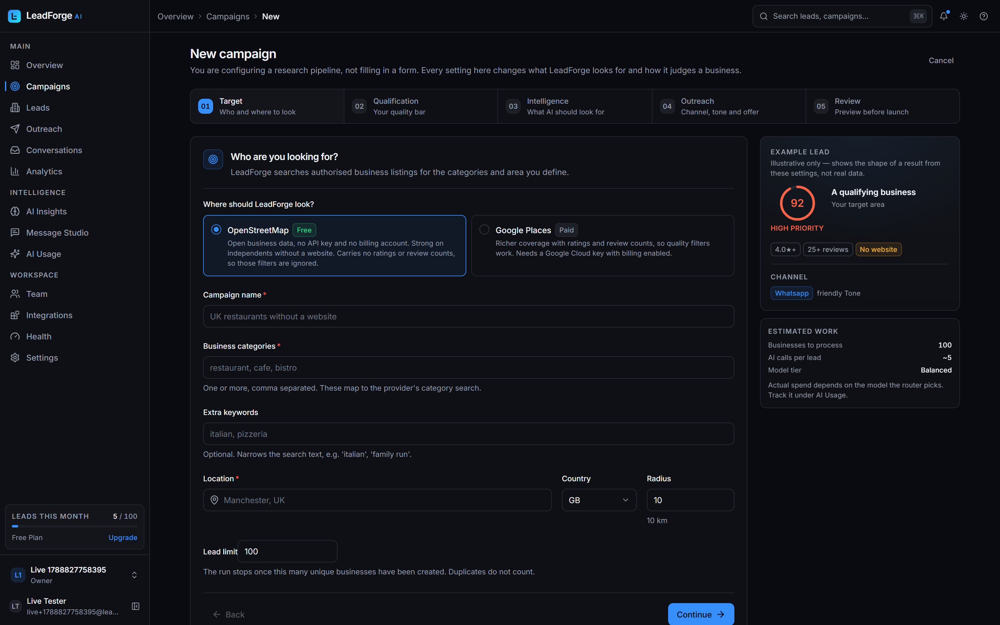
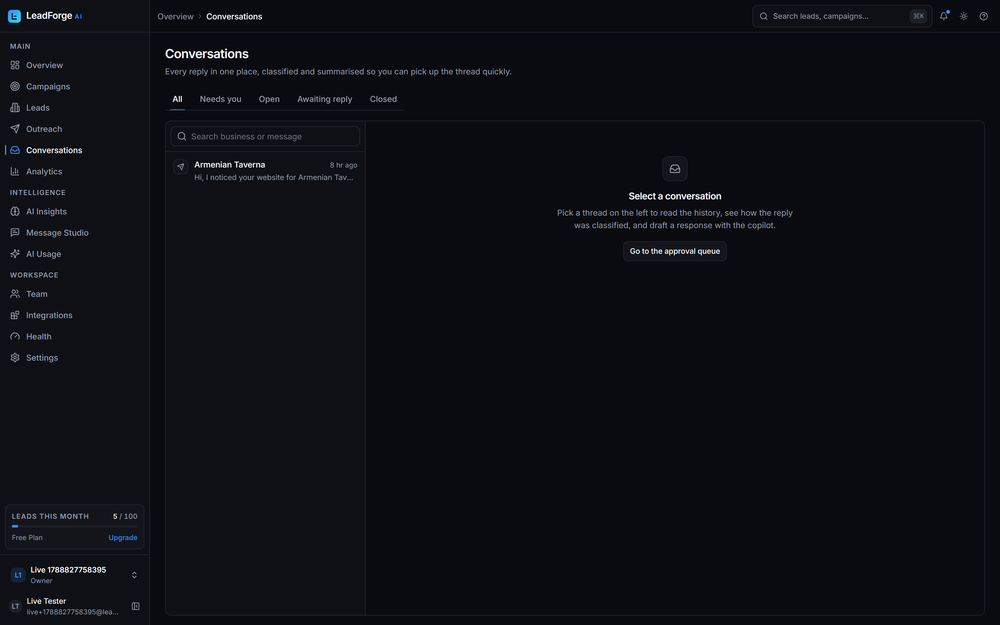
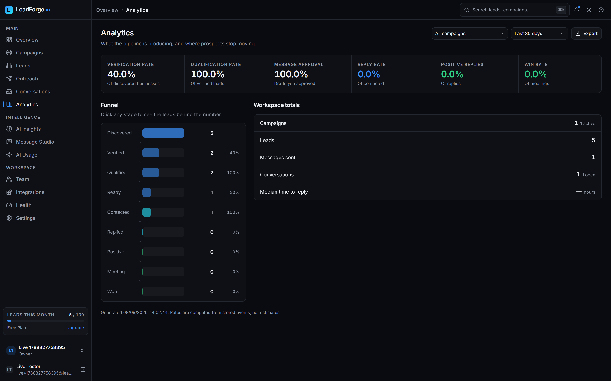
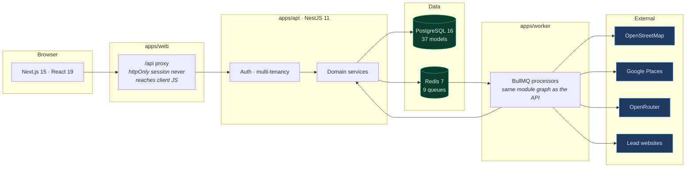

<div align="center">



# LeadForge AI

**Find the right businesses. Understand them. Start the right conversation.**

An AI sales-intelligence platform that researches local businesses, explains
why each one is worth contacting — with citable evidence for every claim — and
drafts the message you would actually send.

[](https://github.com/Ahmadhsn1/leadforge-ai/actions/workflows/ci.yml)
[](https://github.com/Ahmadhsn1/leadforge-ai/actions/workflows/codeql.yml)
[](LICENSE)
[](tsconfig.base.json)
[](.nvmrc)
[](CONTRIBUTING.md)

**198 automated checks** · 87 unit · 14 end-to-end · 68 HTTP · 29 in a real browser

[Quickstart](#quickstart) · [Architecture](#architecture) · [Screens](#the-product) · [Zero-cost setup](#running-at-zero-cost) · [Docs](#documentation)

</div>

---

## The problem this solves

Lead-generation tools hand you a spreadsheet of ten thousand rows and call it
pipeline. Someone still has to open each website, work out whether the business
is worth a message, and write something that does not read like a template.

LeadForge does that research and shows its work.

|                      | Typical lead tool     | LeadForge                                                            |
| -------------------- | --------------------- | -------------------------------------------------------------------- |
| **Output**           | A list of contacts    | A ranked shortlist with a reason for each                            |
| **"Why this lead?"** | Not answered          | Answered, with every claim linked to a stored observation            |
| **Missing data**     | Guessed or left blank | Explicitly `null` — the UI says _Unknown_, never invents             |
| **Scores**           | Opaque model output   | Deterministic across 6 dimensions; the model only explains them      |
| **Messages**         | Mail-merge templates  | Grounded in that business's facts, validated twice before you see it |
| **Sending**          | Fires automatically   | Nothing leaves without your approval                                 |

---

## What makes it different

### Evidence before claims

Every observation the system makes is written to an evidence record with a
source, a timestamp and a confidence. When the model says a business has no
booking call-to-action, that claim carries the evidence id it came from.

**A claim that cannot cite evidence is dropped before it reaches you.** The UI
labels what is `Observed`, what is `Inferred`, and what is simply `Unknown`.

### Scores you can argue with

Six dimensions — ICP fit, opportunity, contactability, business maturity,
evidence confidence, urgency — all computed in code from stored facts. The model
is asked to _explain_ those numbers, and any numbers it returns are discarded.

A score that drifts between runs on identical input cannot be calibrated against
real outcomes, and cannot be defended to a user who asks why a lead lost ten
points overnight.

### Messages that pass a hostile read

Two gates, and the first one cannot be talked out of its verdict:

1. a **deterministic rule engine** (17 tests) — no guaranteed outcomes, no
   invented statistics, no pretending to be an existing customer
2. an **adversarial model check** for the nuance rules cannot express

### Honest about what it cannot do

Instagram's API cannot start a conversation with someone who has not messaged
you first — at any price. WhatsApp charges per marketing message and caps how
many a person can receive. Rather than pretend otherwise, LeadForge ships a
**manual channel**: it does all the research and writing, then hands you a
one-click `wa.me` / `mailto` link to send from your own account. Free, unlimited,
and the only legitimate way to cold-contact on Instagram.

---

## The product

<table>
<tr>
<td width="50%">

**Command centre**


</td>
<td width="50%">

**Message Studio**


</td>
</tr>
<tr>
<td width="50%">

**Leads table**


</td>
<td width="50%">

**Campaign wizard**


</td>
</tr>
<tr>
<td width="50%">

**Conversations**


</td>
<td width="50%">

**Analytics**


</td>
</tr>
</table>

<sub>Real screenshots from a running instance — the lead above is an actual
Manchester restaurant discovered through OpenStreetMap, analysed by a live
model.</sub>

---

## Architecture



The worker does not reimplement the domain — it boots the API's own module graph
as a standalone Nest context. Verification, scoring and outreach are called from
both the HTTP layer and the queue, and two implementations would drift until a
lead scored differently depending on which path touched it.

### The pipeline


Green stages are fully deterministic — no model involved, identical input gives
identical output. Every stage is an idempotent job keyed so a retry cannot
duplicate work.

### Stack

| Layer        | Choice                                                               |
| ------------ | -------------------------------------------------------------------- |
| **Frontend** | Next.js 15 App Router · React 19 · Tailwind · Radix · TanStack Query |
| **Backend**  | NestJS 11 · Prisma 6 · Zod · argon2id · pino · helmet                |
| **Data**     | PostgreSQL 16 · Redis 7 · BullMQ 5                                   |
| **AI**       | OpenRouter gateway with task-based routing and strict JSON schemas   |
| **Repo**     | pnpm workspace · Turborepo · TypeScript strict                       |

---

## Quickstart

```bash
git clone https://github.com/Ahmadhsn1/leadforge-ai.git
cd leadforge-ai
pnpm install

cp .env.example .env          # add OPENROUTER_API_KEY

pnpm docker:up                # or: pnpm services  (native, no Docker/WSL)
pnpm db:migrate
pnpm db:seed
pnpm dev                      # web :3000 · api :4000 · worker
```

Open <http://localhost:3000>, create a workspace, and start a campaign with
source **OpenStreetMap** — it needs no API key at all.

### Commands

```bash
pnpm dev              # everything in watch mode
pnpm build            # packages first, then apps
pnpm typecheck        # strict, with noUncheckedIndexedAccess
pnpm lint             # eslint, zero warnings tolerated
pnpm test             # 87 unit tests
pnpm test:e2e         # 14 tests against a real database
pnpm smoke            # 68 HTTP assertions against a running API
pnpm check:models     # every AI model id still exists on OpenRouter

node scripts/web-smoke.mjs    # 29 assertions in headless Chrome
node scripts/live-e2e.mjs     # a real campaign against real providers

pnpm services         # postgres + redis as native binaries (no Docker)
pnpm services:status
pnpm services:stop
```

---

## Running at zero cost

The whole product runs without a bill:

| Piece         | Free option                                                       |
| ------------- | ----------------------------------------------------------------- |
| **Discovery** | OpenStreetMap — no API key, no billing account, no card           |
| **AI**        | Free OpenRouter models behind a hard `AI_FREE_MODELS_ONLY` filter |
| **Outreach**  | The `manual` channel — no provider needed                         |
| **Postgres**  | Neon free tier, or local                                          |
| **Redis**     | Local                                                             |

[`docs/45-RUNNING-AT-ZERO-COST.md`](docs/45-RUNNING-AT-ZERO-COST.md) covers it
properly — including where free genuinely runs out. The OpenRouter free tier is
about 50 requests a day (≈16 fully-processed leads), and there is no free
always-on cloud host for the worker in 2026. Both are stated plainly rather than
glossed over.

---

## Engineering notes

Things worth knowing before reading the code.

- **Tenant scope always comes from the session.** Never from a body, path or
  query. Queries use `findFirst` with the org id rather than `findUnique` by
  primary key, so a guessed id returns nothing. Asserted on every path by both
  test suites.
- **SSRF protection re-validates after every redirect hop.** Enrichment fetches
  attacker-influenced URLs; private, loopback and cloud-metadata ranges are
  refused before each hop, with byte and time caps.
- **Model output is data, never instruction.** Parsed against a Zod schema;
  invalid output is discarded rather than persisted.
- **Jobs are idempotent** on deterministic keys, with a unique constraint on
  `(queue, idempotencyKey)`.
- **Rate limits reschedule rather than retry.** A daily provider quota used to
  burn five retry attempts in thirty seconds and dead-letter while the quota
  still had hours left.

[`docs/43-IMPLEMENTATION-NOTES.md`](docs/43-IMPLEMENTATION-NOTES.md) records
every deliberate departure from the original design, and the six real bugs that
only surfaced when the system ran against live providers — every test suite was
green while they were broken.

---

## Documentation

| Document                                                    | What it covers                                        |
| ----------------------------------------------------------- | ----------------------------------------------------- |
| [Implementation notes](docs/43-IMPLEMENTATION-NOTES.md)     | Design departures, bugs found, verification performed |
| [Running at zero cost](docs/45-RUNNING-AT-ZERO-COST.md)     | The free path, and where it ends                      |
| [Running without Docker](docs/44-RUNNING-WITHOUT-DOCKER.md) | Native Postgres and Redis on Windows                  |
| [Deployment](infra/deployment/README.md)                    | Provisioning, configuration, operations               |
| [Contributing](CONTRIBUTING.md)                             | Setup, the rules that matter, review expectations     |
| [Security](SECURITY.md)                                     | Reporting, what the code does, known limits           |

The full design set lives in [`docs/`](docs/) — 46 documents covering
discovery, verification, the evidence model, AI routing, scoring, outreach and
deployment.

---

## Licence

[MIT](LICENSE).

Business data discovered through the OpenStreetMap source is © OpenStreetMap
contributors, available under the [ODbL](https://www.openstreetmap.org/copyright).
Attribution is required wherever it is displayed, and the lead detail screen
carries it.
